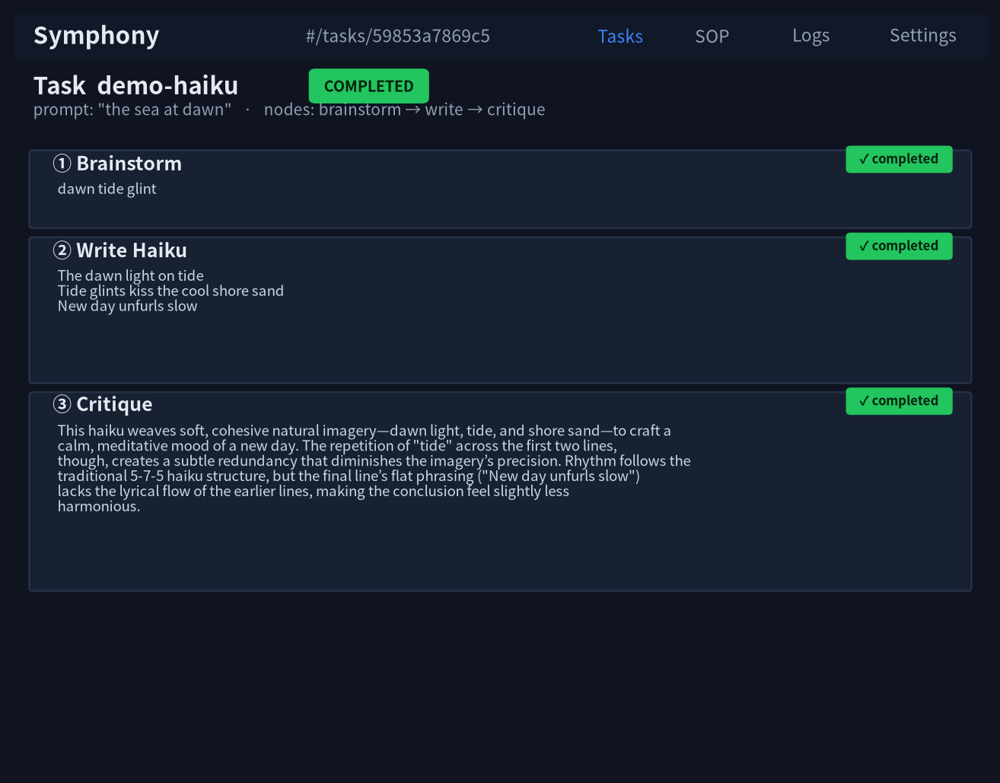
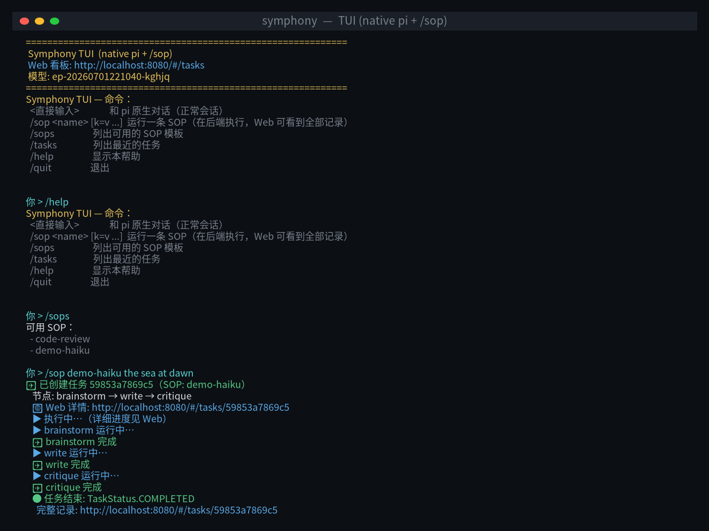
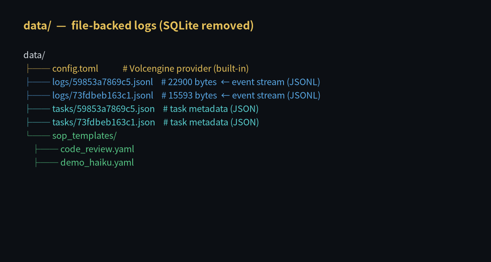
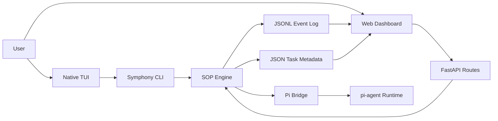

<p align="center">
  <h1 align="center">Symphony</h1>
  <p align="center">
    SOP-based multi-agent task orchestration for pi agent, with native TUI, Web dashboard, file-backed logs, and human-in-the-loop workflows.
  </p>
</p>

<p align="center">
  <a href="https://github.com/Liyurun/symphony/stargazers"></a>
  <a href="https://github.com/Liyurun/symphony/network/members"></a>
  
  
  
  <a href="https://github.com/Liyurun/symphony/commits/main"></a>
  <a href="https://github.com/Liyurun/symphony/blob/main/pyproject.toml"></a>
</p>

<p align="center">
  <a href="#quick-start">Quick Start</a>
  ·
  <a href="#screenshots">Screenshots</a>
  ·
  <a href="#architecture">Architecture</a>
  ·
  <a href="#configuration">Configuration</a>
  ·
  <a href="#star-history">Star History</a>
</p>

---

## Why Symphony

Symphony adds SOP (Standard Operating Procedure) workflow orchestration on top of pi agent. It turns a prompt into a traceable task, runs each SOP node through the agent runtime, and keeps TUI and Web views backed by the same local event log.

| Capability | What it gives you |
| --- | --- |
| SOP orchestration | Define repeatable multi-step workflows with node-level execution records. |
| Native TUI | Keep the pi-style terminal experience and add Symphony commands like `/sop`. |
| Web dashboard | Inspect tasks, node outputs, SOP templates, logs, and settings in a browser. |
| Human-in-the-loop | Pause workflows for approval or manual input before continuing. |
| Redo and retry | Re-run failed or stale nodes and cascade downstream execution. |
| File-backed storage | Store JSONL event streams and JSON task metadata without SQLite. |

## Screenshots

### Web Task Detail



### Native TUI



### File-Backed Logs



## Quick Start

Run this from the project root:

```bash
bash install.sh
```

The installer detects or installs `uv`, builds pi for RPC mode, and runs `uv tool install --editable .`.

Start Symphony from anywhere:

```bash
symphony
```

Then open the Web dashboard:

```text
http://localhost:8080
```

## Architecture



Symphony keeps runtime state in local files. Events are appended to `data/logs/<task_id>.jsonl`, task metadata is stored in `data/tasks/<task_id>.json`, and both TUI and Web read from the same source of truth.

## Configuration

### Command Flags

```bash
symphony --provider-url https://ark.cn-beijing.volces.com/api/v3 --provider-key sk-xxx --provider-model doubao-1.5-pro-32k
```

### Environment Variables

```bash
export SYMPHONY_PROVIDER_URL=https://ark.cn-beijing.volces.com/api/v3
export SYMPHONY_PROVIDER_KEY=sk-xxx
export SYMPHONY_PROVIDER_MODEL=doubao-1.5-pro-32k
symphony
```

### Config File

Symphony creates `data/config.toml` on first launch. You can also copy from `data/config.toml.example`.

```toml
[provider]
base_url = "https://ark.cn-beijing.volces.com/api/v3"
api_key = "sk-xxx"
model = "doubao-1.5-pro-32k"
max_tokens = 4096
temperature = 0.7

[pi_agent]
binary_path = "pi"
default_model = "custom/doubao-1.5-pro-32k"
thinking_level = "medium"
auto_compaction = true

[web_ui]
host = "0.0.0.0"
port = 8080
theme = "dark"
auto_scroll = true
max_log_entries = 1000

[tui]
theme = "textual-dark"
compact_view = false
log_normal_chat = true
```

| Field | Description | Default |
| --- | --- | --- |
| `provider.base_url` | OpenAI-compatible API endpoint | - |
| `provider.api_key` | Provider API key | - |
| `provider.model` | Model ID | `doubao-1.5-pro-32k` |
| `provider.max_tokens` | Maximum output tokens | `4096` |
| `provider.temperature` | Sampling temperature | `0.7` |
| `pi_agent.binary_path` | pi executable path | auto-detected |
| `pi_agent.thinking_level` | Agent thinking depth | `medium` |
| `web_ui.port` | Web dashboard port | `8080` |
| `web_ui.theme` | Web dashboard theme | `dark` |

### pi `settings.json`

If pi already has a provider configured, point Symphony to that model directly:

```bash
symphony --pi-model doubao/doubao-1.5-pro-32k
```

## Web UI

Open `http://localhost:8080` after starting Symphony.

| Route | Page |
| --- | --- |
| `#/tasks` | Task list |
| `#/tasks/:id` | Task detail with node outputs, approvals, and redo controls |
| `#/sop` | SOP template editor |
| `#/logs` | Event log viewer |
| `#/settings` | Runtime settings |

## TUI Commands

| Input | Action |
| --- | --- |
| `<plain text>` | Chat with the native pi agent and optionally write the session into local logs. |
| `/sop <name> [k=v ...] [natural language]` | Run an SOP from the terminal and inspect it in Web UI. |
| `/sops` | List available SOP templates. |
| `/tasks` | List recent tasks. |
| `/help` | Show help. |
| `/quit` | Exit. |

## Project Structure

```text
symphony/
├── pyproject.toml
├── install.sh
├── data/
│   ├── config.toml.example
│   └── sop_templates/
├── docs/images/
├── symphony/
│   ├── cli.py
│   ├── config/
│   ├── core/
│   ├── sop/
│   ├── tui/
│   └── web/
├── pi-agent/
└── tests/
```

## Testing

```bash
uv run pytest tests/ -v
```

Or:

```bash
python3 -m pytest tests/ -q
```

## Star History

[](https://www.star-history.com/#Liyurun/symphony&Date)
